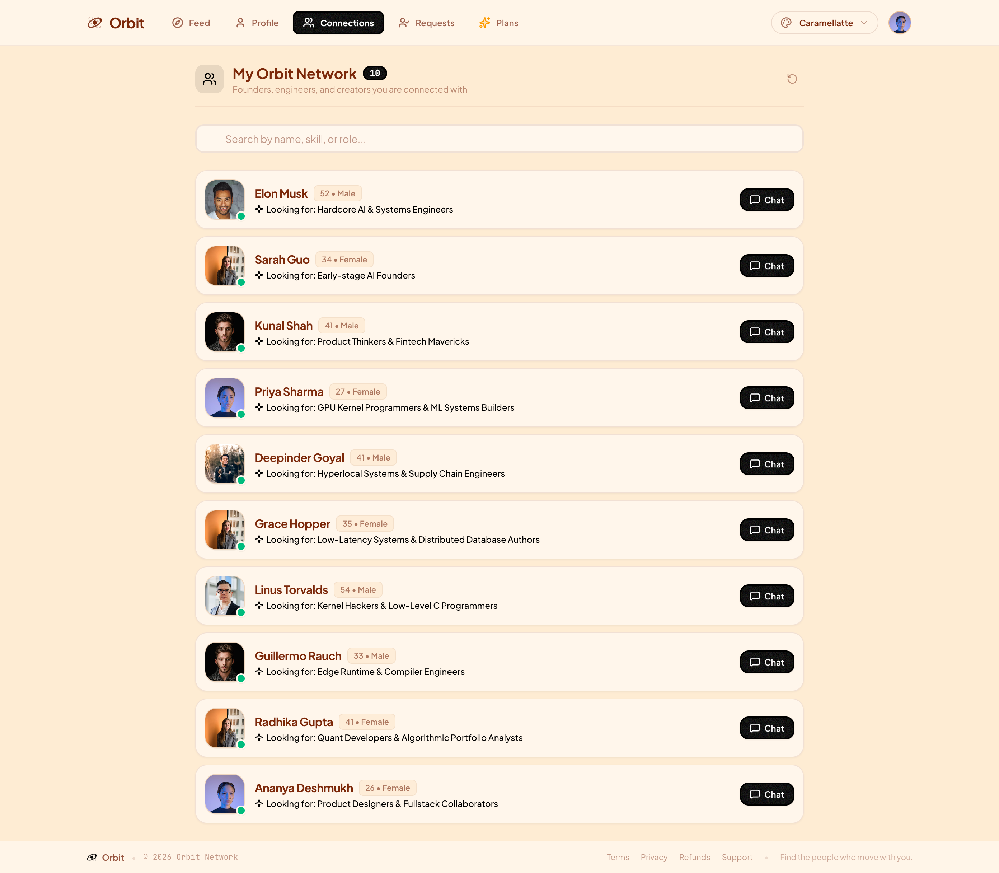
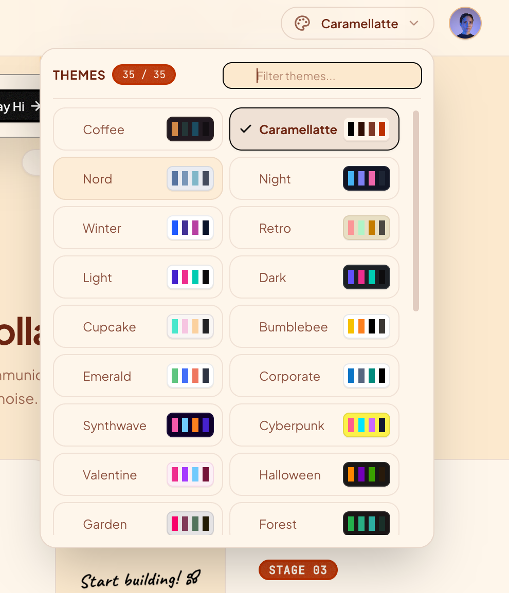
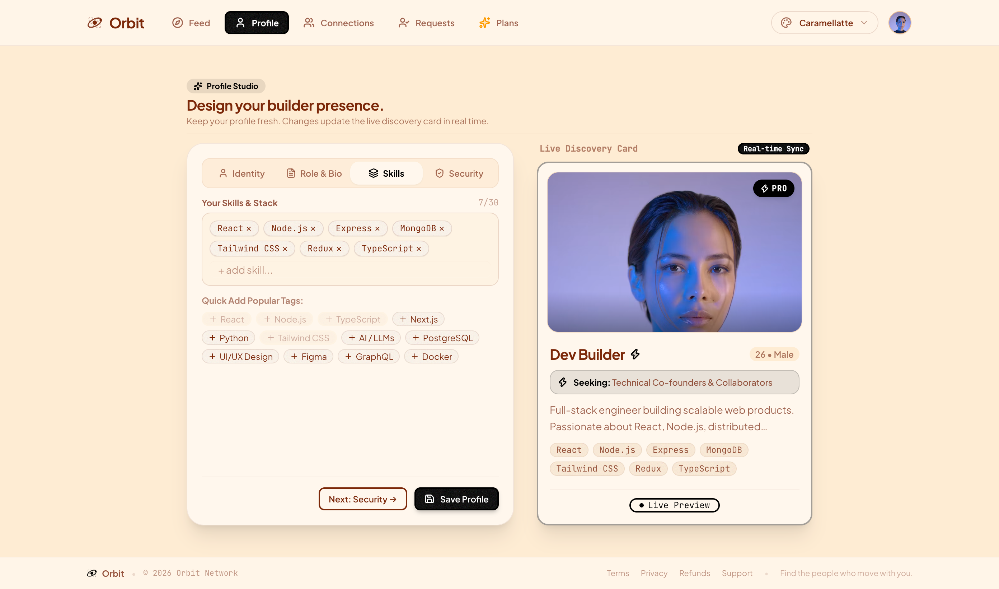
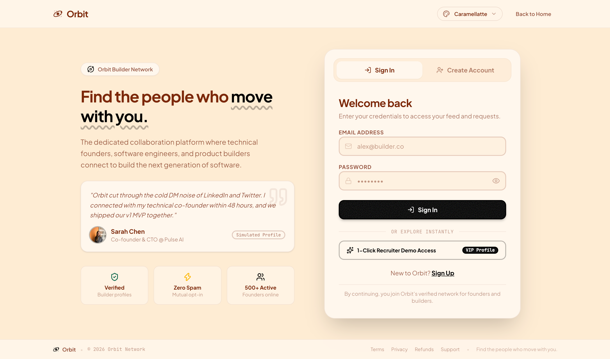
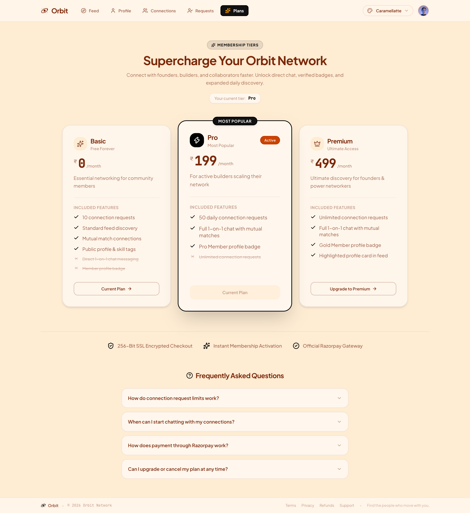
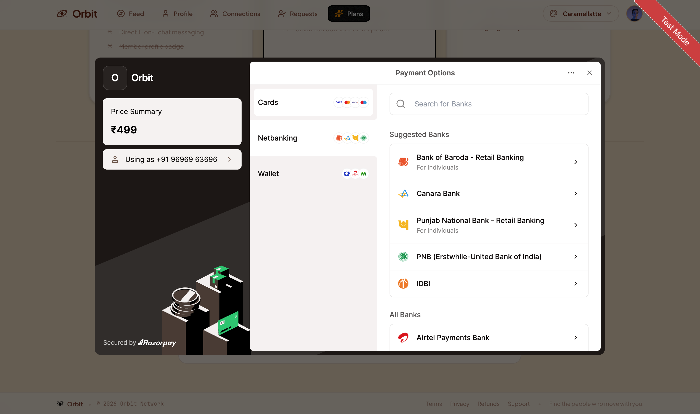

# Orbit | Frontend

A modern developer networking and collaboration platform for tech founders, software engineers, and builders to discover peers, exchange connection requests, and message in real time.

---

## Live Deployment

- **Production URL:** [https://withorbit.tech/](https://withorbit.tech/)
- **API Endpoint:** `https://withorbit.tech/api`

---

## Interface Overview

### Landing Experience (Dual Theme Showcase)

Orbit features a design system supporting 35 semantic themes with instant switching and local persistence.

| Caramellatte (Warm Accent) | Coffee (Dark Roast) |
| :--- | :--- |
|  |  |

---

### Core User Flows

#### 1. Discovery Deck & Builder Feed
Interactive card deck with swipe gestures (Pass / Connect), keyboard shortcuts, tag filtering, and 3D card zoom inspection.


#### 2. Network Management (Connections & Requests)
Structured two-way connection lifecycle. Review incoming requests with acceptance/rejection actions and manage mutual connections.

| Received Connection Requests | Active Connections Directory |
| :--- | :--- |
|  |  |

#### 3. 35-Theme Dynamic Palette Engine
Instant theme switching powered by DaisyUI semantic tokens and Tailwind CSS v4. Includes a dedicated search filter and zero-flash `localStorage` persistence.

<p align="center">
  
</p>

#### 4. Account Settings & Authentication
Responsive profile editor for updating developer bio, skills array, and profile imagery, paired with a secure auth portal.

| Profile Settings Editor | Authentication Portal |
| :--- | :--- |
|  |  |

#### 5. Tiered Membership & Checkout Flow
Integrated Razorpay checkout supporting Card, Netbanking, UPI, and Wallet payment methods with cryptographic backend signature verification.

| Membership Tiers | Razorpay Modal Checkout |
| :--- | :--- |
|  |  |

---

## Technical Architecture

- **React 19 & Vite:** Fast compilation with modern React compiler ergonomics and optimized asset chunking.
- **Redux Toolkit (`@reduxjs/toolkit`):** Normalized global store managing authenticated user session, discovery feed stack, received requests, and accepted connections.
- **Real-Time WebSockets (`socket.io-client`):** Duplex connection for instant 1-on-1 messaging, real-time typing broadcasts, and live peer online/offline indicators.
- **DOM Virtualization (`react-virtuoso`):** Bidirectional windowed list rendering (`START_INDEX = 10000`) ensuring 60fps scrolling performance through large message histories.
- **Micro-Interactions (`motion/react`):** Spring-physics modals, swipe gestures, layout morphing, and organic ink-pen SVG path animations.
- **Styling Architecture:** Tailwind CSS v4 paired with DaisyUI v5 semantic color variables across 35 curated themes.

---

## Key Engineering Challenges & Solutions

### 1. Eliminating Cumulative Layout Shift (CLS) in Dynamic Card Stacks
- **Problem:** Dynamic bio lengths and variable-length skill badge arrays caused vertical layout shifts during initial render and autoplay card swaps.
- **Solution:** Locked the hero card deck viewport constraints to fixed heights (`h-[520px] sm:h-[540px]`), applied strict `line-clamp-2` bounds on bios, and bounded the badge container with hidden overflow.

### 2. WebSocket Re-Render Abort Races in React 19
- **Problem:** In React 19, when asynchronous user profiles or chat partner metadata resolved, state updates triggered component re-renders that invoked `socket.disconnect()` during active handshakes, resulting in `WebSocket closed before connection established` warnings.
- **Solution:** Isolated the socket connection lifecycle from non-essential re-render triggers. Cached target user metadata in stable `useRef` containers and configured Socket.IO client transport to prioritize native WebSockets (`transports: ["websocket", "polling"]`).

### 3. Infinite Message History Memory Management
- **Problem:** Appending unvirtualized chat history degraded memory and created frame drops during rapid scroll on mobile viewports.
- **Solution:** Implemented `react-virtuoso` windowed recycling with inverted scrolling, preserving DOM node counts under 30 elements regardless of total thread length.

---

## Production Deployment & Multi-Cloud Portability

1. **Production Infrastructure (AWS EC2 + Cloudflare)**:
   - Built to static production assets via Vite.
   - Hosted on an **AWS EC2 (Ubuntu)** instance served by **Nginx** with Single Page Application (`try_files $uri $uri/ /index.html;`) routing.
   - Fronted by **Cloudflare** for edge SSL/TLS termination, HTTP/2 multiplexing, and DDoS mitigation.
2. **Cloud-Agnostic Design**:
   - The frontend is fully decoupled from cloud-specific primitives. While configured and run on bare-metal AWS EC2 for production testing, the static output can deploy seamlessly to **Vercel**, **AWS CloudFront/S3**, or **Netlify** for cost-efficient compute governance.

---

## Tech Stack

- **UI Framework:** React 19, Vite
- **State Layer:** Redux Toolkit, React-Redux
- **Styling & Theming:** Tailwind CSS v4, DaisyUI v5 (35 Themes)
- **Animation & Gestures:** Motion v13
- **Icons:** Lucide React
- **Real-Time Client:** Socket.IO Client
- **Virtualization:** React Virtuoso
- **Network Client:** Axios
- **Payment SDK:** Razorpay Standard Checkout

---

## Local Development Setup

### 1. Clone the repository
```bash
git clone https://github.com/the-ajay-panigrahi/orbit-frontend.git
cd orbit-frontend
```

### 2. Install dependencies
```bash
npm install
```

### 3. Environment Variables
Create a `.env` file in the project root:
```env
VITE_BASE_URL="http://localhost:7777"
```

### 4. Run Development Server
```bash
npm run dev
```

### 5. Build for Production
```bash
npm run build
```

---

## Author

**Ajay Panigrahi**
- Website: [https://withorbit.tech](https://withorbit.tech)
- GitHub: [@the-ajay-panigrahi](https://github.com/the-ajay-panigrahi)
- LinkedIn: [Ajay Panigrahi](https://www.linkedin.com/in/ajay-panigrahi/)
