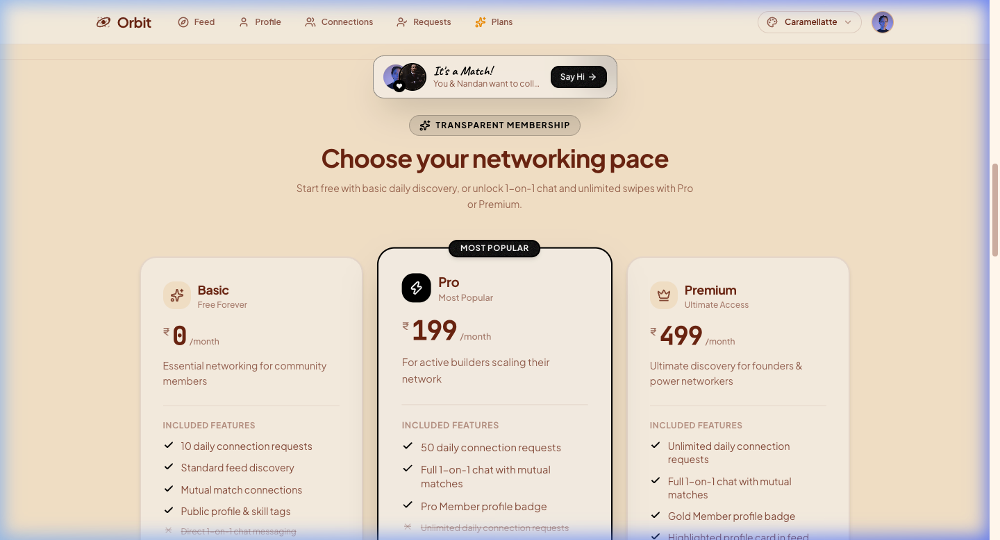
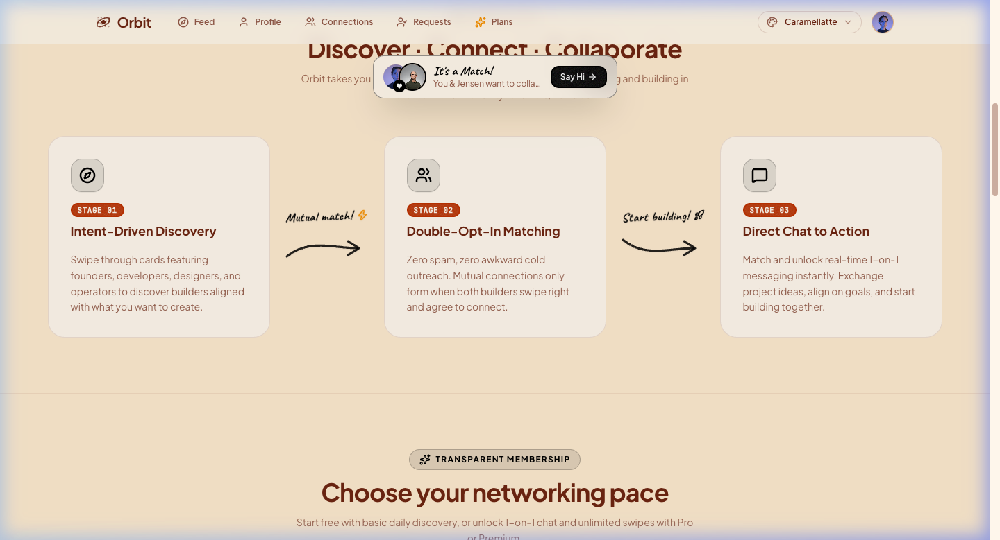

# Orbit | Frontend

**Discover, connect, and collaborate with tech founders, developers, and builders worldwide.**

Orbit is a production-grade developer networking and collaboration platform designed for the modern tech ecosystem. Built with **React 19**, **Vite**, **Tailwind CSS v4**, and **Motion v13**, Orbit blends the engaging discovery mechanics of swipe-style decks with professional connection management, real-time messaging, and tiered subscriptions.

---

## 🚀 Live Link

**Launch Orbit →** [https://withorbit.tech/](https://withorbit.tech/)

---

## 🖼️ Screenshots

### Dual Palette Showcase (Caramellatte & Coffee Themes)

| Caramellatte Theme (Warm Latte Aesthetic) | Coffee Theme (Dark Roast Aesthetic) |
| :---: | :---: |
|  |  |

<details>
<summary><b>View Additional Screenshots & Cloud Infrastructure Previews</b></summary>

<br />

#### Real-Time 1-on-1 Chat Interface
<p align="center">
  
</p>

#### Pricing & Premium Membership Tiers
<p align="center">
  
</p>

#### Profile & Customization Settings
<p align="center">
  
</p>

#### AWS EC2 & Cloudflare Deployment Infrastructure
<p align="center">
  <!-- Placeholder for AWS / Cloudflare deployment screenshot -->
  
</p>

</details>

---

## 🔧 Features

- **Interactive Discovery Deck:** Dynamic swipeable builder feed with real-time pass/interested actions and 3D card expansion modals.
- **Real-Time 1-on-1 Messaging:** Instant WebSocket-powered communication with live online/offline badges, real-time typing indicators, and auto-scroll recovery.
- **Virtualized Message Stream:** Implemented using `react-virtuoso` for smooth, 60fps infinite scrolling through thousands of messages without DOM bloat or frame drops.
- **36 Handcrafted DaisyUI Themes:** Complete dynamic theming engine supporting **36 distinct palettes** (including `caramellatte`, `coffee`, `synthwave`, `dracula`, `nord`, and `luxury`) with zero-flicker `localStorage` persistence and an interactive live theme studio.
- **Bespoke Micro-Interactions:** Custom SVG handwritten title accents, spring-physics modals, and seamless tab transitions orchestrated with `motion/react`.
- **Tiered Membership Gateways:** Seamless integration with **Razorpay Checkout SDK** for instant upgrades between Free, Pro, and Premium tiers.
- **Robust Centralized State:** Predictable global state management using **Redux Toolkit** (authenticated user, feed deck, incoming requests, and active connections).
- **Backend Cron Integration:** Fully reactive to automated backend cron reminders (users receive daily AWS SES digests when they have pending connection requests).
- **Fully Responsive & Accessible:** Optimized for mobile touchscreens, tablets, and high-DPI desktop viewports.

---

## 🎨 36-Theme Engine Architecture

Orbit features a deep design system with **36 curated themes** powered by Tailwind CSS v4 and DaisyUI v5:
- **Instant Palette Swapping:** Users can switch between 36 themes instantly via the global navigation palette dropdown.
- **Live Theme Studio:** The landing page features a dedicated interactive showcase previewing popular themes (`caramellatte`, `coffee`, `nord`, `dracula`, `synthwave`, `cyberpunk`, `retro`, `forest`, etc.) so users can explore before signing up.
- **Persistent State:** Theme preference is persisted via `localStorage` and injected at HTML root level (`data-theme`) to eliminate theme flashing during initial paint.

---

## 🌐 Cloud Infrastructure & Deployment

The Orbit frontend is engineered to be cloud-flexible and resilient:

1. **Self-Hosted Production Setup (AWS + Cloudflare)**:
   - Built to static production assets via Vite.
   - Hosted on an **AWS EC2 Ubuntu** instance served by a high-performance **Nginx** web server (`/var/www/html`) with `try_files` SPA routing.
   - Fronted by **Cloudflare** for edge SSL termination, global CDN caching, and automated DDoS mitigation.
2. **Cost-Conscious Cloud Redundancy**:
   - To demonstrate production DevOps mastery, Orbit was deployed from bare-metal on **AWS EC2 with Nginx & Cloudflare**.
   - Because cloud infrastructure credits on EC2 are finite, the project is architected with cloud portability in mind: the static Vite frontend can seamlessly transition between **Vercel, AWS CloudFront, or Nginx** with zero code refactoring.

---

## 💡 Why I Built This

Traditional professional networks often feel corporate, transactional, and detached from the way developers actually build things. I wanted to build **Orbit** to provide a visually stunning, fast, and tactile platform tailored specifically for indie builders, open-source maintainers, and startup founders. 

Building Orbit allowed me to solve deep real-world frontend engineering challenges: managing real-time WebSocket connection lifecycles across React component lifecycles, eliminating Cumulative Layout Shift (CLS) on responsive hero sections, virtualizing dense message feeds, and orchestrating secure payment flows.

---

## 🧱 Challenges & Lessons

### 1. Eliminating Cumulative Layout Shift (CLS) in Dynamic Hero Decks
- **The Challenge:** Responsive card stacks with varying bio lengths and skill badge counts were causing intermittent layout shifts during initial load and auto-swapping intervals.
- **How I Tackled It:** Locked the hero deck viewport constraints (`h-[520px] sm:h-[540px]`), applied strict `line-clamp-2` constraints on bios, and bounded skill container dimensions with hidden overflow to maintain a rock-solid layout.

### 2. WebSocket Re-renders & Connection Races in React 19
- **The Challenge:** Initial socket setups disconnected prematurely during handshakes when asynchronous user profiles or chat partner states resolved, triggering browser console abort warnings (`WebSocket is closed before the connection is established`).
- **How I Tackled It:** Decoupled socket lifecycle from non-essential re-render dependencies by moving partner metadata into stable `useRef` containers and configuring Socket.IO to prioritize native WebSocket transport (`transports: ["websocket", "polling"]`).

### 3. Infinite Message History Performance
- **The Challenge:** Rendering long chat histories caused DOM bloat, high memory overhead, and noticeable scroll stuttering on mobile devices.
- **How I Tackled It:** Leveraged `react-virtuoso` with bidirectional item indexing (`START_INDEX = 10000`) and windowed DOM recycling, preserving smooth 60fps scrolling and instant message appending.

---

## 🧠 What I Learned

- Mastering **React 19 & Redux Toolkit** patterns for scalable, decoupled single-page application architectures.
- Managing real-time bidirectional event streams with **Socket.IO Client** without leaking socket instances or creating duplicate event listeners.
- Crafting production-grade micro-interactions with **Motion v13** (spring physics, layout morphing, and path drawing animations).
- Safe integration of third-party SDKs like **Razorpay Checkout** within a strict single-page application lifecycle.
- Achieving zero layout shifts and high Google Lighthouse performance scores through defensive styling and responsive CSS design.

---

## 🗂️ Tech Stack

- **Framework & Core:** [React 19](https://react.dev/), [Vite](https://vitejs.dev/)
- **State Management:** [Redux Toolkit](https://redux-toolkit.js.org/), [React-Redux](https://react-redux.js.org/)
- **Styling & UI:** [Tailwind CSS v4](https://tailwindcss.com/), [DaisyUI v5](https://daisyui.com/), [Lucide React](https://lucide.dev/)
- **Animations:** [Motion v13](https://motion.dev/)
- **Real-Time Client:** [Socket.IO Client](https://socket.io/docs/v4/client-api/)
- **Virtualization:** [React Virtuoso](https://virtuoso.dev/)
- **HTTP Client:** [Axios](https://axios-http.com/)
- **Payments:** Razorpay Standard Checkout SDK

---

## 📁 Project Setup

### 1. Clone the repository
```bash
git clone https://github.com/the-ajay-panigrahi/orbit-frontend.git
cd orbit-frontend
```

### 2. Install dependencies
```bash
npm install
```

### 3. Configure environment variables
Create a `.env` file in the root directory:
```env
VITE_BASE_URL="http://localhost:7777"
```

### 4. Run the development server
```bash
npm run dev
```

### 5. Build for production
```bash
npm run build
```

---

## 👨‍💻 Author

**Ajay Panigrahi**
- Website: [https://withorbit.tech](https://withorbit.tech)
- GitHub: [@the-ajay-panigrahi](https://github.com/the-ajay-panigrahi)
- LinkedIn: [Ajay Panigrahi](https://www.linkedin.com/in/ajay-panigrahi/)
